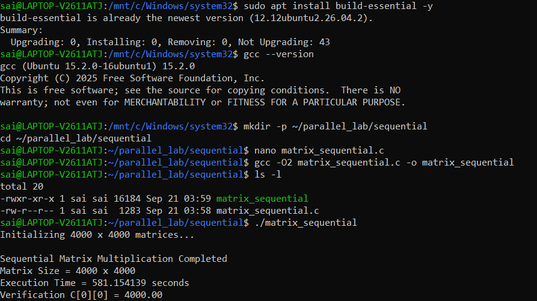
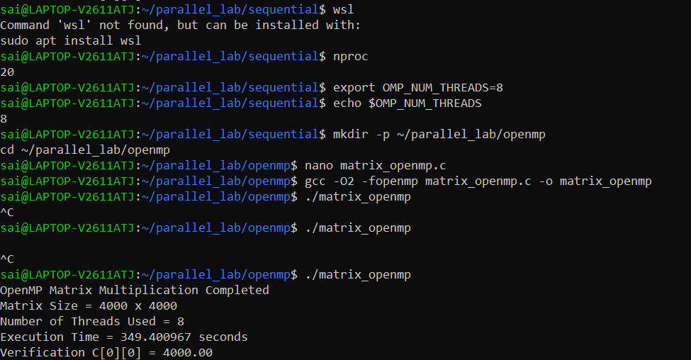

<div align="center">

# ⚡ High-Performance Matrix Multiplication

### Sequential CPU • OpenMP • MPI • CUDA

**Parallel & Grid Computing Laboratory**

[](#)
[](#)
[](#)
[](#)
[](#)
[](#)

<br>

**A reproducible laboratory study of the same $4000 \times 4000$ dense matrix-multiplication workload across serial, shared-memory, distributed-memory, and GPU execution models.**

</div>

---

## 🧭 At a Glance

This repository studies how the execution model changes the performance of a computationally intensive matrix multiplication workload.

| Experiment | Execution Model | Parallel Units | Measured / Recorded Runtime | Verification |
|---|---|---:|---:|---|
| **01 — Sequential** | Serial CPU | 1 thread | **989.350313 s** | `C[0][0] = 4000.00` |
| **02 — OpenMP** | Shared-memory CPU | 8 threads | **336.447981 s** | `C[0][0] = 4000.00` |
| **03 — MPI** | Distributed-memory CPU | 4 MPI processes | **92.980 s*** | `C[0][0] = 4000.00` |
| **04 — CUDA** | GPU kernel execution | 16×16 blocks | **248.401382 ms** | `C[0][0] = 4000.00` |

> **Benchmark integrity:** the sequential and OpenMP timings above come directly from the supplied terminal execution proofs. The MPI value is the recorded result already documented by the MPI experiment. CUDA reports **kernel execution time**, not end-to-end application time, so it is intentionally not converted into a misleading CPU speedup.

\* The MPI benchmark uses its corresponding MPI experiment baseline and should not be interpreted as a controlled head-to-head comparison with the Sequential/OpenMP screenshot run.

---

## 🏆 Key Observations

### OpenMP

Using 8 CPU threads, the supplied OpenMP execution reduced the measured multiplication runtime from **989.350313 s** to **336.447981 s**.

$$
S_{OMP} = \frac{T_{seq}}{T_{OMP}}
= \frac{989.350313}{336.447981}
\approx \mathbf{2.941\times}
$$

- **Speedup:** **2.941×**
- **Runtime reduction:** **65.99%**
- **8-thread parallel efficiency:** **36.76%**
- **Correctness:** `C[0][0] = 4000.00` ✅

### CUDA

The supplied NVIDIA CUDA execution proof reports:

```text
Matrix Size            = 4000 x 4000
Block Size             = 16 x 16
Grid Size              = 250 x 250
Kernel Execution Time  = 248.401382 milliseconds
Verification C[0][0]   = 4000.00
```

The screenshot also documents an initial unsupported-toolchain PTX error, followed by a successful rebuild using:

```powershell
nvcc -O2 -arch=sm_86 matrix_cuda.cu -o matrix_cuda.exe
```

This is valuable reproducibility evidence: the successful run explicitly targets **sm_86**.

---

# 📐 1. Problem Definition

For two dense matrices $A$ and $B$:

$$
A,B \in \mathbb{R}^{N \times N}
$$

the product $C = A \times B$ is:

$$
C_{i,j} = \sum_{k=0}^{N-1} A_{i,k}B_{k,j}
$$

For this laboratory workload:

$$
N = 4000
$$

and the input matrices are initialized with:

$$
A_{i,j} = 1, \qquad B_{i,j} = 1
$$

Therefore:

$$
C_{i,j} = \sum_{k=0}^{3999} 1 = 4000
$$

which gives the deterministic verification target:

```text
C[0][0] = 4000.00
```

### Computational workload

The conventional triple-loop algorithm performs approximately:

$$
2N^3 = 2(4000)^3 = 128 \times 10^9
$$

floating-point operations, or approximately **128 GFLOPs of arithmetic work**.

The algorithmic complexity remains:

$$
\boxed{O(N^3)}
$$

Parallelism changes **how the work is executed**, not the underlying mathematical operation.

---

# ⚙️ 2. Execution Models

```text
                         4000 × 4000 Matrix Multiplication
                                      │
             ┌────────────────────────┼────────────────────────┐
             │                        │                        │
             ▼                        ▼                        ▼
       Sequential CPU             OpenMP CPU               MPI CPU
        1 thread                  8 threads                4 processes
             │                        │                        │
             ▼                        ▼                        ▼
       Shared process          Shared memory          Message passing
             │                        │                        │
             └────────────────────────┼────────────────────────┘
                                      │
                                      ▼
                                Correct Matrix C
                              C[0][0] = 4000.00

                                      │
                                      ▼
                               CUDA GPU Execution
                              16×16 thread blocks
```

| Model | Memory Model | Parallel Unit | Communication |
|---|---|---|---|
| Sequential | Single address space | CPU thread | None |
| OpenMP | Shared memory | CPU thread | Shared memory + synchronization |
| MPI | Distributed memory | Process / rank | Explicit messages |
| CUDA | GPU global/shared/register memory | CUDA thread | GPU memory hierarchy + synchronization |

---

# 🗂️ 3. Repository Structure

```text
PGC-lab/
├── 01-Sequential/
│   └── matrix_sequential.c
│
├── 02-OpenMP/
│   └── matrix_openmp.c
│
├── 03-MPI/
│   └── matrix_mpi.c
│
├── 04-cuda/
│   └── 04_cuda.png
│
├── assets/
│   └── screenshots/
│       ├── sequential_run.png
│       ├── openmp_run.png
│       ├── 4_cuda.png
│       ├── mpi_ping.png
│       ├── worker1_mpi.png
│       ├── worker2_mpi.png
│       ├── worker3_mpi.png
│       ├── ssh_worker1.png
│       ├── ssh_worker2.png
│       ├── ssh_worker3.png
│       └── wsl_setup.png
│
├── Makefile
├── Sequential.md
├── OpenMP.md
├── MPI.md
└── README.md
```

---

# 🧪 4. Experiment 01 — Sequential Baseline

The baseline uses a conventional C triple loop:

```c
for (int i = 0; i < N; i++) {
    for (int j = 0; j < N; j++) {
        double sum = 0.0;

        for (int k = 0; k < N; k++) {
            sum += A[i * N + k] * B[k * N + j];
        }

        C[i * N + j] = sum;
    }
}
```

### Recorded execution

```text
Matrix Size = 4000 x 4000
Execution Time = 989.350313 seconds
Verification C[0][0] = 4000.00
```

### Terminal proof

<div align="center">



</div>

---

# 🚀 5. Experiment 02 — OpenMP Shared-Memory Parallelism

The OpenMP implementation parallelizes the outer matrix loop.

```c
#pragma omp parallel
{
    #pragma omp single
    threads_used = omp_get_num_threads();

    #pragma omp for schedule(dynamic, 16)
    for (int i = 0; i < N; i++) {
        for (int j = 0; j < N; j++) {
            double sum = 0.0;

            for (int k = 0; k < N; k++) {
                sum += A[i * N + k] * B[k * N + j];
            }

            C[i * N + j] = sum;
        }
    }
}
```

The supplied run used:

```bash
export OMP_NUM_THREADS=8
```

### Measured result

| Metric | Value |
|---|---:|
| Matrix | `4000 × 4000` |
| Threads | `8` |
| Sequential time | `989.350313 s` |
| OpenMP time | **`336.447981 s`** |
| Speedup | **`2.941×`** |
| Runtime reduction | **`65.99%`** |
| Efficiency | **`36.76%`** |
| Verification | **`4000.00`** |

### Terminal proof

<div align="center">



</div>

---

# 🌐 6. Experiment 03 — MPI Distributed-Memory Parallelism

The MPI implementation divides the matrix workload across multiple MPI processes.

Conceptually:

```text
                         Master / Rank 0
                               │
                    Distribute matrix slices
                               │
              ┌────────────────┼────────────────┐
              ▼                ▼                ▼
           Rank 1            Rank 2            Rank 3
        Compute slice      Compute slice      Compute slice
              │                │                │
              └────────────────┼────────────────┘
                               ▼
                         Gather results
                               │
                               ▼
                         Complete C
```

The implementation uses point-to-point MPI communication to distribute work and collect the resulting matrix slices.

### Recorded MPI run

| Parameter | Recorded value |
|---|---:|
| Matrix | `4000 × 4000` |
| MPI processes | `4` |
| Execution time | `92.980 s` |
| Recorded speedup | `2.63×` |
| Verification | `C[0][0] = 4000.00` |

> **Important:** the MPI timing was recorded in the existing MPI experiment with its corresponding sequential reference of `244.120 s`. It is therefore presented as a separate MPI benchmark rather than being merged into the sequential/OpenMP run above.

---

# 🟢 7. Experiment 04 — CUDA GPU Execution

The fourth execution path demonstrates GPU-accelerated matrix multiplication using CUDA.

### CUDA configuration captured in the terminal proof

| Parameter | Value |
|---|---:|
| Matrix size | `4000 × 4000` |
| Block size | `16 × 16` |
| Grid size | `250 × 250` |
| Threads per block | `256` |
| Kernel execution time | **`248.401382 ms`** |
| Verification | **`C[0][0] = 4000.00`** |
| Target architecture | `sm_86` |

For a `4000 × 4000` output and `16 × 16` block:

$$
\frac{4000}{16} = 250
$$

so the execution uses:

$$
250 \times 250
$$

thread blocks.

### Reproducibility detail

The terminal evidence shows an initial CUDA launch failure:

```text
CUDA Error: the provided PTX was compiled with an unsupported toolchain.
```

The program was then rebuilt for the detected GPU architecture:

```powershell
nvcc -O2 -arch=sm_86 matrix_cuda.cu -o matrix_cuda.exe
```

and successfully executed.

### CUDA execution proof

<div align="center">


</div>

> **Measurement scope:** `248.401382 ms` is explicitly reported as **Kernel Execution Time**. It should not be directly compared with the CPU wall-clock measurements unless the CPU and GPU measurements are taken using the same timing scope, including or excluding initialization and transfer costs consistently.

---

# 📊 8. Benchmark Dashboard

## CPU Shared-Memory Comparison

```text
Sequential   989.350313 s  ██████████████████████████████████████████████████
OpenMP       336.447981 s  █████████████████
```

### OpenMP improvement

```text
Baseline       : 989.350313 s
OpenMP         : 336.447981 s
Time saved     : 652.902332 s
Runtime reduced: 65.99%
Speedup        : 2.941×
```

---

## All Recorded Execution Evidence

| Experiment | Platform / Model | Configuration | Time | Result |
|---|---|---|---:|---|
| Sequential | CPU | 1 thread | **989.350313 s** | `4000.00` |
| OpenMP | CPU | 8 threads | **336.447981 s** | `4000.00` |
| MPI | CPU / distributed model | 4 processes | **92.980 s*** | `4000.00` |
| CUDA | NVIDIA GPU | 16×16 blocks | **248.401382 ms** | `4000.00` |

---

# 📈 9. Performance Mathematics

## Speedup

For a controlled sequential/parallel comparison:

$$
S(p) = \frac{T_{serial}}{T_{parallel}}
$$

For the supplied Sequential → OpenMP run:

$$
S(8) =
\frac{989.350313}{336.447981}
\approx \boxed{2.941\times}
$$

---

## Runtime Reduction

$$
Reduction =
\frac{T_{serial}-T_{parallel}}{T_{serial}}
\times 100
$$

$$
=
\frac{989.350313-336.447981}{989.350313}
\times100
\approx \boxed{65.99\%}
$$

---

## Parallel Efficiency

For $p$ OpenMP threads:

$$
E(p) = \frac{S(p)}{p} \times 100
$$

With 8 threads:

$$
E(8) =
\frac{2.941}{8} \times 100
\approx \boxed{36.76\%}
$$

An efficiency below 100% is expected in real systems because parallel execution introduces scheduling, synchronization, memory-system, and other overheads.

---

## Amdahl's Law

The theoretical upper bound for a program with serial fraction $f$ is:

$$
S(p) = \frac{1}{f + \frac{1-f}{p}}
$$

As $p$ increases, the serial portion becomes the limiting factor. This explains why doubling the number of workers does not automatically produce a 2× speedup.

---

# 🧠 10. Why Matrix Multiplication Is Memory-Intensive

The naive implementation accesses:

```text
A[i][k]  → row-wise traversal
B[k][j]  → column-wise traversal
```

Because C stores arrays in row-major order, accessing `B[k][j]` while incrementing `k` can produce large memory strides.

For `N = 4000` and `double` values:

$$
4000 \times 8 = 32000\text{ bytes}
$$

between adjacent accesses down a column.

This can reduce cache locality and increase pressure on the memory hierarchy.

Important performance factors include:

- CPU cache locality
- Memory bandwidth
- Memory latency
- Thread scheduling
- Synchronization
- Process communication
- GPU global-memory access patterns
- Kernel launch overhead
- CPU/GPU data-transfer overhead

---

# 🔬 11. Correctness Verification

The experiment deliberately initializes:

```text
A[i][j] = 1.0
B[i][j] = 1.0
```

Therefore:

```text
C[i][j] = 4000.0
```

All supplied execution proofs report:

```text
Verification C[0][0] = 4000.00
```

This provides a simple deterministic correctness check across the implementations.

> A single-element check is useful as a smoke test, but a production benchmark would ideally validate the complete output matrix or use a checksum/hash plus numerical tolerance.

---

# 🛠️ 12. Build & Run

## Prerequisites

### CPU / WSL

```bash
sudo apt update
sudo apt install build-essential
```

For OpenMP:

```bash
gcc --version
```

For MPI:

```bash
mpicc --version
mpirun --version
```

### CUDA

A working NVIDIA driver and CUDA Toolkit with `nvcc` are required.

Verify:

```powershell
nvidia-smi
nvcc --version
```

---

## Build Everything Available to the Makefile

From the `PGC-lab` directory:

```bash
make
```

The supplied Makefile builds:

```text
matrix_sequential
matrix_openmp
matrix_mpi
```

Clean generated CPU binaries:

```bash
make clean
```

---

## Sequential

```bash
gcc -O2 -Wall 01-Sequential/matrix_sequential.c -o matrix_sequential
./matrix_sequential
```

---

## OpenMP

```bash
gcc -O2 -Wall -fopenmp 02-OpenMP/matrix_openmp.c -o matrix_openmp

export OMP_NUM_THREADS=8
./matrix_openmp
```

---

## MPI

```bash
mpicc -O2 -Wall 03-MPI/matrix_mpi.c -o matrix_mpi
mpirun -np 4 ./matrix_mpi
```

---

## CUDA

The supplied execution proof uses Windows PowerShell:

```powershell
nvcc -O2 -arch=sm_86 matrix_cuda.cu -o matrix_cuda.exe
.\matrix_cuda.exe
```

> The current repository snapshot contains the CUDA execution proof image but does not contain `matrix_cuda.cu`. Therefore the CUDA command above documents the command visible in the supplied terminal evidence rather than claiming that the source file is currently present in this ZIP.

---

# 🖥️ 13. Execution Proof Gallery

### Sequential


### OpenMP — 8 Threads


### CUDA — GPU Kernel


Additional MPI / environment evidence is available under:

```text
PGC-lab/assets/screenshots/
```

---

# 🧩 14. OpenMP vs MPI vs CUDA

| Dimension | OpenMP | MPI | CUDA |
|---|---|---|---|
| Hardware | Multicore CPU | CPU / cluster | NVIDIA GPU |
| Execution unit | Thread | Process / rank | CUDA thread |
| Memory model | Shared | Distributed | GPU memory hierarchy |
| Communication | Shared memory | Explicit MPI messages | Device memory / synchronization |
| Best suited for | Multicore shared-memory workloads | Distributed / cluster workloads | Highly parallel GPU workloads |
| Programming style | Compiler directives | Communication API | Kernel programming |
| Main overhead | Thread scheduling / synchronization | Communication / data distribution | Kernel launch / memory movement |
| Experiment configuration | 8 threads | 4 processes | 16×16 blocks |

---

# 🎓 15. Learning Outcomes

This laboratory demonstrates practical understanding of:

- Serial vs parallel execution
- $O(N^3)$ computational complexity
- Shared-memory programming
- OpenMP directives
- Thread-level parallelism
- Distributed-memory programming
- MPI process/rank architecture
- Message passing
- GPU kernel execution
- CUDA launch configuration
- Block and grid dimensions
- Speedup
- Parallel efficiency
- Amdahl's Law
- Cache locality
- Memory bandwidth
- Benchmark methodology
- Correctness verification
- Reproducible execution evidence

---

# ⚠️ 16. Benchmarking Notes

Performance measurements are hardware- and environment-dependent.

The supplied evidence contains executions from different environments and experiment runs. Consequently:

1. **Sequential → OpenMP** is the controlled comparison reported here because both timings come from the supplied CPU execution evidence.
2. The **MPI result** is retained as the recorded MPI experiment result and has its own corresponding baseline.
3. The **CUDA result is kernel-only timing**, so it is not treated as a directly comparable wall-clock CPU measurement.
4. CPU frequency scaling, thermal state, WSL overhead, memory pressure, compiler version, and background processes can affect timings.
5. Re-running the experiments may produce different absolute times.

This distinction keeps the benchmark analysis technically honest rather than presenting incompatible measurements as one perfectly controlled benchmark.

---

# 🏁 17. Conclusion

This project moves the same computational problem through four execution paradigms:

```text
                  MATRIX MULTIPLICATION
                          │
        ┌─────────────────┼─────────────────┐
        │                 │                 │
        ▼                 ▼                 ▼
    Sequential         OpenMP              MPI
     1 thread         8 threads         4 processes
        │                 │                 │
        └─────────────────┼─────────────────┘
                          │
                          ▼
                       CUDA
                    NVIDIA GPU
```

The supplied CPU execution demonstrates that OpenMP can substantially reduce runtime by distributing loop iterations across CPU threads, while MPI demonstrates explicit distributed-memory computation. The additional CUDA execution proof extends the laboratory into GPU acceleration and records a **248.401382 ms kernel execution** for the 4000×4000 workload.

Most importantly, every supplied implementation reaches the same deterministic verification value:

```text
C[0][0] = 4000.00
```

That makes the repository not only a collection of programs, but a compact study of **how architecture, parallelism, memory, communication, and workload partitioning influence performance**.

---

## 📚 Experiment Documentation

- [Sequential Experiment](PGC-lab/Sequential.md)
- [OpenMP Experiment](PGC-lab/OpenMP.md)
- [MPI Experiment](PGC-lab/MPI.md)
- [Source: Sequential](PGC-lab/01-Sequential/matrix_sequential.c)
- [Source: OpenMP](PGC-lab/02-OpenMP/matrix_openmp.c)
- [Source: MPI](PGC-lab/03-MPI/matrix_mpi.c)
- [Build Automation](PGC-lab/Makefile)

---

<div align="center">

### ⚡ Parallelism is not just about doing more work — it is about doing the same work intelligently.

**Parallel & Grid Computing Laboratory**

</div>
